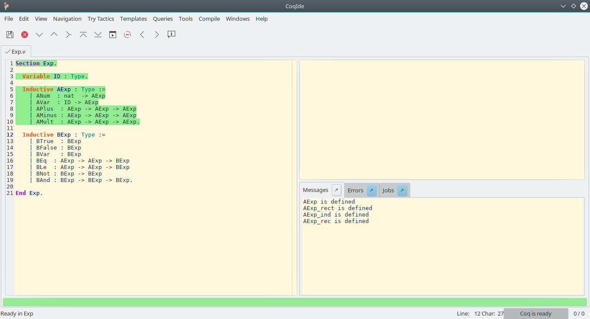

# Coq
*motivational and meaningful intro text*

## Installation
Binaries for Windows and MacOS can be found [here](https://coq.inria.fr/download). Linux users may install Coq via the package manager or by compiling the sources, as described [here](https://coq.inria.fr/cocorico/Installation%20of%20Coq%20on%20Linux).

## Compiling Coq programs
The provided Coq files can be compiled by running
``` bash
coq_makefile -f _CoqProject -o Makefile
```
followed by `make`. The generated `Makefile` updates itself upon execution; therefore, subsequent compilations do not require manually using `coq_makefile`. The Coq compiler `coqc` can be invoked manually when working with small projects.

## Working with Coq
There are two popular options for writing code and constructing proofs in Coq: CoqIDE and Proof General. The former is a [graphical tool](https://coq.inria.fr/refman/Reference-Manual018.html) that features basic editing capabilities and a simple interface for proofs and the current (sub)goals. On Windows and MacOS, CoqIDE is distributed with the Coq installer, while the Linux packages are usually separated into `coq` and `coqide`.

 

[Proof General](https://proofgeneral.github.io/) is an Emacs extension that provides a front-end to Coq for the popular ~~operating system~~ editor. The extension collection [Company-Coq](https://github.com/cpitclaudel/company-coq) includes Proof General and adds even more features, such as prettification of operators and support for some LaTeX commands, powerful auto-completion and shortcuts to quickly query the Coq documentation.

|  |  |
|:---:|:---:|


## Proof General

The notation `C-k` means pressing the control key `C` and the key `k`.

`C-x C-f` Open or create file

`C-x C-s` Save file

`C-c C-n` Process the next command relative to the current position in the proof.

`C-c C-c` Interrupt processing of current command.

`C-c C-u` Undo the last successful command.

`C-c C-BS` (BS = Backspace) Undo and delete the last successful command.

`C-c C-RET` (RET = Return) Process file up to the cursor position if possible.

`C-c C-b` Process whole file if possible.

`C-c C-r` Reset processing to the beginning of the file.

`C-c .` Toggle the 'electric terminator' mode. If activated, commands are processed as soon as the `.` is typed.
